# BreezeX Cursor

A clone of the repository [ful1e5](https://github.com/ful1e5/BreezeX_Cursor)

## Prerequisites (Fedora KDE)

Before compiling the theme from source, you must install the native development libraries, Node.js environment, and Python-based cursor-building tools.

Open your terminal and run the following command to install the required packages on Fedora:

```Bash
# 1. Install system development libraries, Node.js, and Yarn
sudo dnf install libX11-devel libXcursor-devel libpng-devel nodejs yarn python3-pip

# 2. Install clickgen (the engine used to build the cursors)
pip install --user clickgen
```

## Quick Start (From the Beginning)

If you are setting this up on a fresh machine or starting completely from scratch:
#### 1. Clone the Repository
Clone the BreezeX Cursor repository and navigate into the project root:

```Bash
git clone git@github.com:armaneousuf/Breeze-dark-custom-cursor.git
cd BreezeX_Cursor
```
#### 2. Install Project Dependencies
Use Yarn to install the node packages required for rendering:

```Bash
yarn install
```
For next steps use the deploy.sh script by executing `chmod +x deploy.sh` then `./deploy.sh`

> NOTE: deploy.sh won't be there by default. It's a script to automate the work so one have to create it or copy paste from this repo

or you can manually do next steps:

```Bash
yarn render
./build.sh # depends where the build.sh is
cp -r themes/BreezeX-Dark ~/.icons/
sudo cp -r themes/BreezeX-Dark /usr/share/icons/ # only needed if you need to change SDDM cursors too
```
## Login Screen (SDDM) Note

Your login screen runs under a system user and cannot access your home folder (~/.icons/). The deploy.sh script automatically handles copying your cursor theme to /usr/share/icons/ so that your cursor theme is available for the login screen.

---

## Cursor Icons Gallery

<div style="display: flex; flex-direction: column; gap: 10px; padding: 20px;">
  <div style="display: flex; align-items: center; gap: 15px;">
    
    <span style="font-size: 14px; font-weight: 500;">X_cursor</span>
  </div>
  <div style="display: flex; align-items: center; gap: 15px;">
    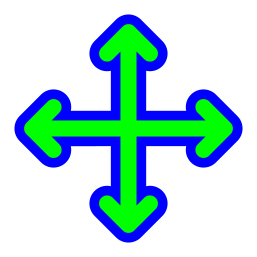
    <span style="font-size: 14px; font-weight: 500;">all-scroll</span>
  </div>
  <div style="display: flex; align-items: center; gap: 15px;">
    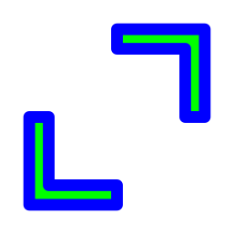
    <span style="font-size: 14px; font-weight: 500;">bd_double_arrow</span>
  </div>
  <div style="display: flex; align-items: center; gap: 15px;">
    
    <span style="font-size: 14px; font-weight: 500;">bottom_left_corner</span>
  </div>
  <div style="display: flex; align-items: center; gap: 15px;">
    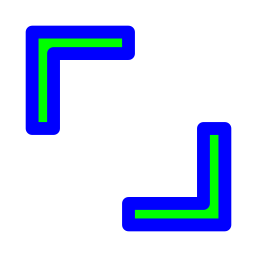
    <span style="font-size: 14px; font-weight: 500;">bottom_right_corner</span>
  </div>
  <div style="display: flex; align-items: center; gap: 15px;">
    
    <span style="font-size: 14px; font-weight: 500;">bottom_side</span>
  </div>
  <div style="display: flex; align-items: center; gap: 15px;">
    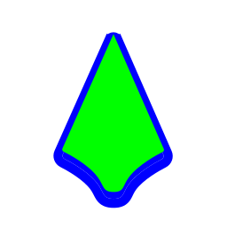
    <span style="font-size: 14px; font-weight: 500;">center_ptr</span>
  </div>
  <div style="display: flex; align-items: center; gap: 15px;">
    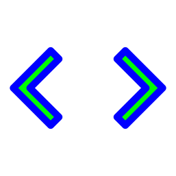
    <span style="font-size: 14px; font-weight: 500;">col-resize</span>
  </div>
  <div style="display: flex; align-items: center; gap: 15px;">
    
    <span style="font-size: 14px; font-weight: 500;">color-picker</span>
  </div>
  <div style="display: flex; align-items: center; gap: 15px;">
    
    <span style="font-size: 14px; font-weight: 500;">context-menu</span>
  </div>
  <div style="display: flex; align-items: center; gap: 15px;">
    
    <span style="font-size: 14px; font-weight: 500;">copy</span>
  </div>
  <div style="display: flex; align-items: center; gap: 15px;">
    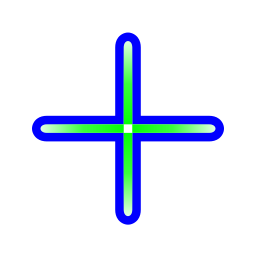
    <span style="font-size: 14px; font-weight: 500;">cross</span>
  </div>
  <div style="display: flex; align-items: center; gap: 15px;">
    
    <span style="font-size: 14px; font-weight: 500;">crossed_circle</span>
  </div>
  <div style="display: flex; align-items: center; gap: 15px;">
    
    <span style="font-size: 14px; font-weight: 500;">dnd_no_drop</span>
  </div>
  <div style="display: flex; align-items: center; gap: 15px;">
    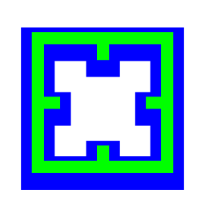
    <span style="font-size: 14px; font-weight: 500;">dotbox</span>
  </div>
  <div style="display: flex; align-items: center; gap: 15px;">
    
    <span style="font-size: 14px; font-weight: 500;">fd_double_arrow</span>
  </div>
  <div style="display: flex; align-items: center; gap: 15px;">
    
    <span style="font-size: 14px; font-weight: 500;">hand1</span>
  </div>
  <div style="display: flex; align-items: center; gap: 15px;">
    
    <span style="font-size: 14px; font-weight: 500;">hand2</span>
  </div>
  <div style="display: flex; align-items: center; gap: 15px;">
    
    <span style="font-size: 14px; font-weight: 500;">left_ptr</span>
  </div>
  <div style="display: flex; align-items: center; gap: 15px;">
    
    <span style="font-size: 14px; font-weight: 500;">left_side</span>
  </div>
  <div style="display: flex; align-items: center; gap: 15px;">
    
    <span style="font-size: 14px; font-weight: 500;">link</span>
  </div>
  <div style="display: flex; align-items: center; gap: 15px;">
    
    <span style="font-size: 14px; font-weight: 500;">move</span>
  </div>
  <div style="display: flex; align-items: center; gap: 15px;">
    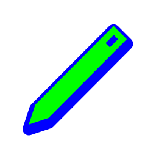
    <span style="font-size: 14px; font-weight: 500;">pencil</span>
  </div>
  <div style="display: flex; align-items: center; gap: 15px;">
    
    <span style="font-size: 14px; font-weight: 500;">person</span>
  </div>
  <div style="display: flex; align-items: center; gap: 15px;">
    
    <span style="font-size: 14px; font-weight: 500;">pin</span>
  </div>
  <div style="display: flex; align-items: center; gap: 15px;">
    
    <span style="font-size: 14px; font-weight: 500;">pirate</span>
  </div>
  <div style="display: flex; align-items: center; gap: 15px;">
    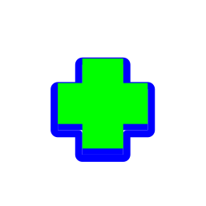
    <span style="font-size: 14px; font-weight: 500;">plus</span>
  </div>
  <div style="display: flex; align-items: center; gap: 15px;">
    
    <span style="font-size: 14px; font-weight: 500;">question_arrow</span>
  </div>
  <div style="display: flex; align-items: center; gap: 15px;">
    
    <span style="font-size: 14px; font-weight: 500;">right_ptr</span>
  </div>
  <div style="display: flex; align-items: center; gap: 15px;">
    
    <span style="font-size: 14px; font-weight: 500;">right_side</span>
  </div>
  <div style="display: flex; align-items: center; gap: 15px;">
    
    <span style="font-size: 14px; font-weight: 500;">row-resize</span>
  </div>
  <div style="display: flex; align-items: center; gap: 15px;">
    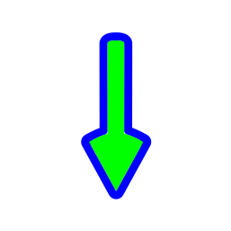
    <span style="font-size: 14px; font-weight: 500;">sb_down_arrow</span>
  </div>
  <div style="display: flex; align-items: center; gap: 15px;">
    
    <span style="font-size: 14px; font-weight: 500;">sb_h_double_arrow</span>
  </div>
  <div style="display: flex; align-items: center; gap: 15px;">
    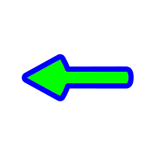
    <span style="font-size: 14px; font-weight: 500;">sb_left_arrow</span>
  </div>
  <div style="display: flex; align-items: center; gap: 15px;">
    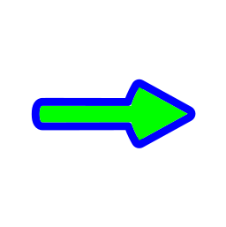
    <span style="font-size: 14px; font-weight: 500;">sb_right_arrow</span>
  </div>
  <div style="display: flex; align-items: center; gap: 15px;">
    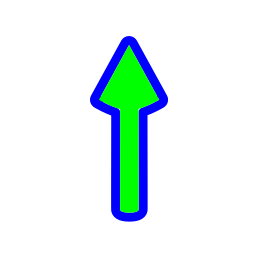
    <span style="font-size: 14px; font-weight: 500;">sb_up_arrow</span>
  </div>
  <div style="display: flex; align-items: center; gap: 15px;">
    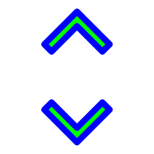
    <span style="font-size: 14px; font-weight: 500;">sb_v_double_arrow</span>
  </div>
  <div style="display: flex; align-items: center; gap: 15px;">
    
    <span style="font-size: 14px; font-weight: 500;">top_left_corner</span>
  </div>
  <div style="display: flex; align-items: center; gap: 15px;">
    
    <span style="font-size: 14px; font-weight: 500;">top_right_corner</span>
  </div>
  <div style="display: flex; align-items: center; gap: 15px;">
    
    <span style="font-size: 14px; font-weight: 500;">top_side</span>
  </div>
  <div style="display: flex; align-items: center; gap: 15px;">
    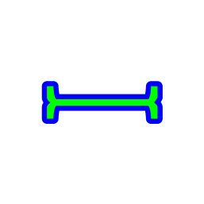
    <span style="font-size: 14px; font-weight: 500;">vertical-text</span>
  </div>
  <div style="display: flex; align-items: center; gap: 15px;">
    
    <span style="font-size: 14px; font-weight: 500;">wayland-cursor</span>
  </div>
  <div style="display: flex; align-items: center; gap: 15px;">
    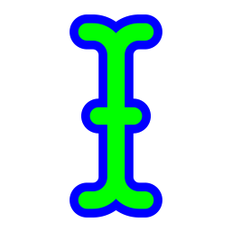
    <span style="font-size: 14px; font-weight: 500;">xterm</span>
  </div>
  <div style="display: flex; align-items: center; gap: 15px;">
    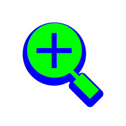
    <span style="font-size: 14px; font-weight: 500;">zoom-in</span>
  </div>
  <div style="display: flex; align-items: center; gap: 15px;">
    
    <span style="font-size: 14px; font-weight: 500;">zoom-out</span>
  </div>
</div>
